# SPRING PLUS

## 필수 기능
LV1.
1. @Transactional(readonly=true) 인 경우 save 가 되지 않음.
2. 유저 엔티티에 nickname 추가 및 jwt에 nickname 추가
3. todo list조회시 수정일(범위), weather 조건 검색 기능 추가
- 작동 확인 캡쳐
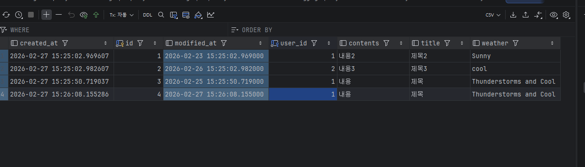 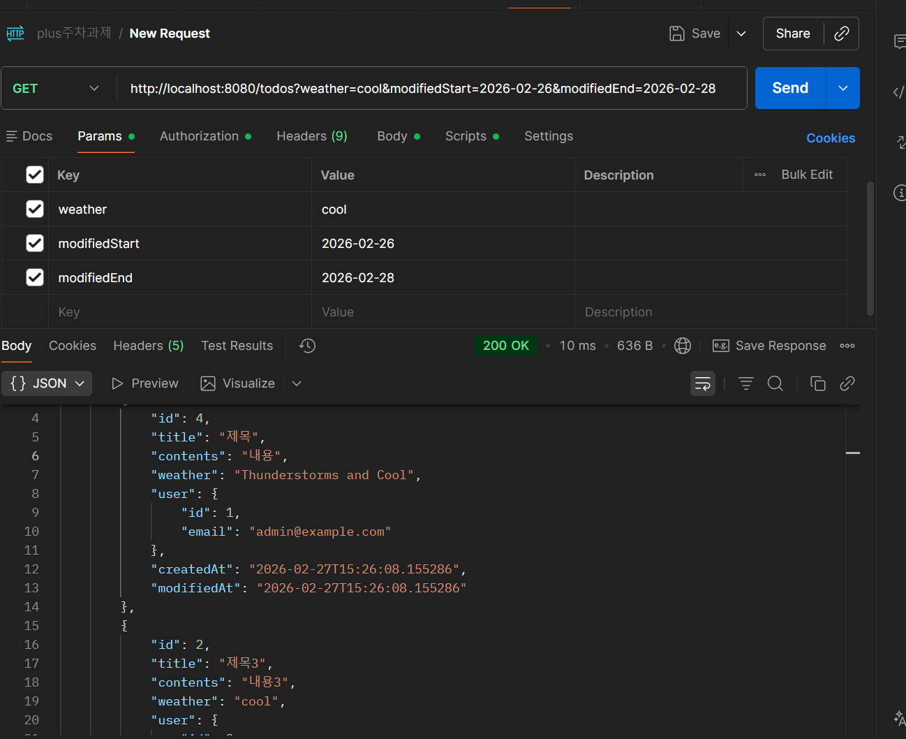
4. 테스트: 예외가 발생하는 테스트에 isOk로 작성하여 200을 예측하였으나 400이 돌아와 실패하였음
```
//이 부분을 수정해야 한다
.andExpect(status().isOk()) 
```
5. aop @Before로 수정
- 로그 확인
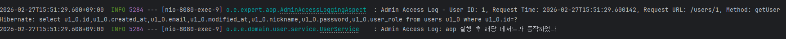

### Lv2.
1. CascadeType.ALL
- CascadeType.persist: 부모 저장시 자식도 같이 저장
- all: 저장, 병합, 삭제 등을 다같이
- 따라서 all로 작성하였다. 
- manager 잘 저장됨을 확인
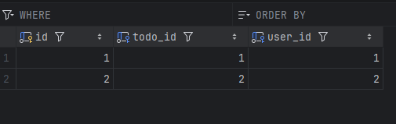

2. N+1
- 레포지토리에 fetch join을 사용하여 수정하였다

  | 구분 | 이미지 |
  |------|--------|
  | 기존 | 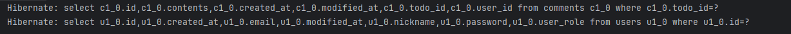 |
  | 수정 | 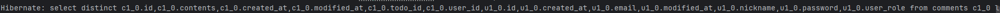 |


3. queryDSL
- findIdWithUserDsl 함수를 추가하였다.

4. 스프링 시큐리티
- security 패키지 아래 내용과 config 폴더 아래 securityConfig 를 추가하였다.
- 유저로 로그인한 결과 역할바꾸기 안됨
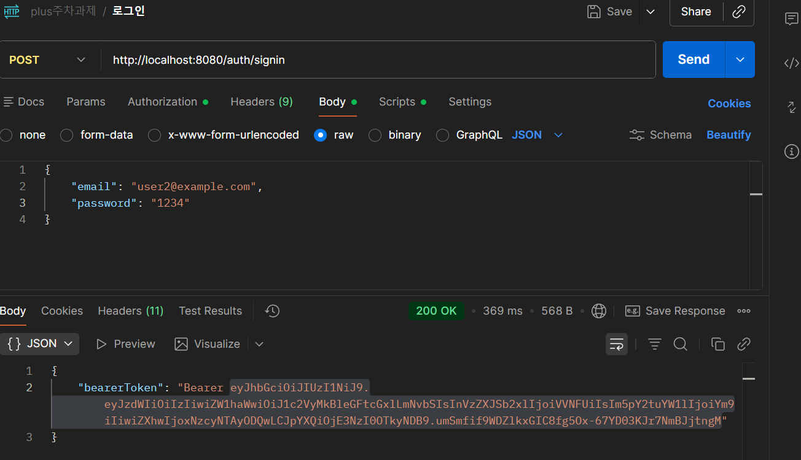
- 비밀번호 바꾸기도 잘 동작함
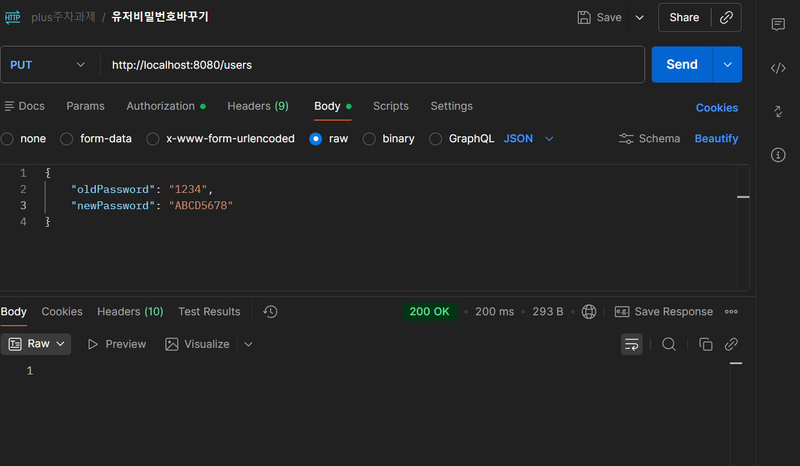
- 관리자로 로그인한 결과 역할바꾸기 가능
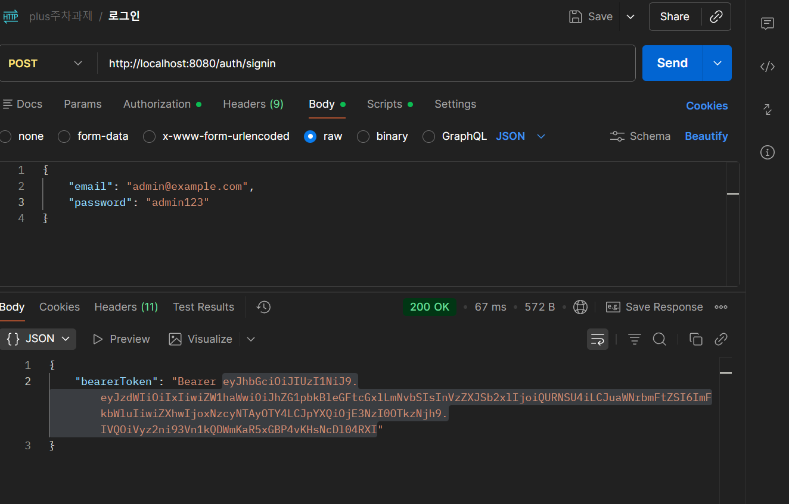
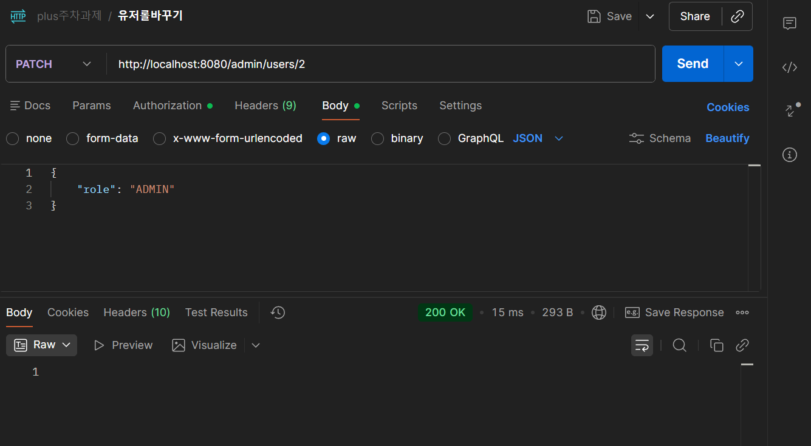


### Lv3.
1. query dsl 추가
- 일정을 검색하는 쿼리 dsl 만들기(검색 조건: 제목 부분일치, 생성일 범위, 담당자 이름 부분일치)
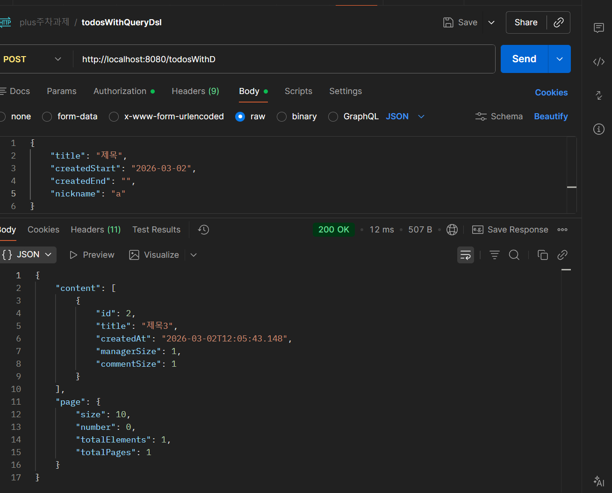

2. 매니저 등록 로그 테이블 생성
- 매니저 등록 성공 여부와 상관없이 로그 저장하기
- 아래와 같이 매니저 등록은 실패하였으나 로그는 남았음
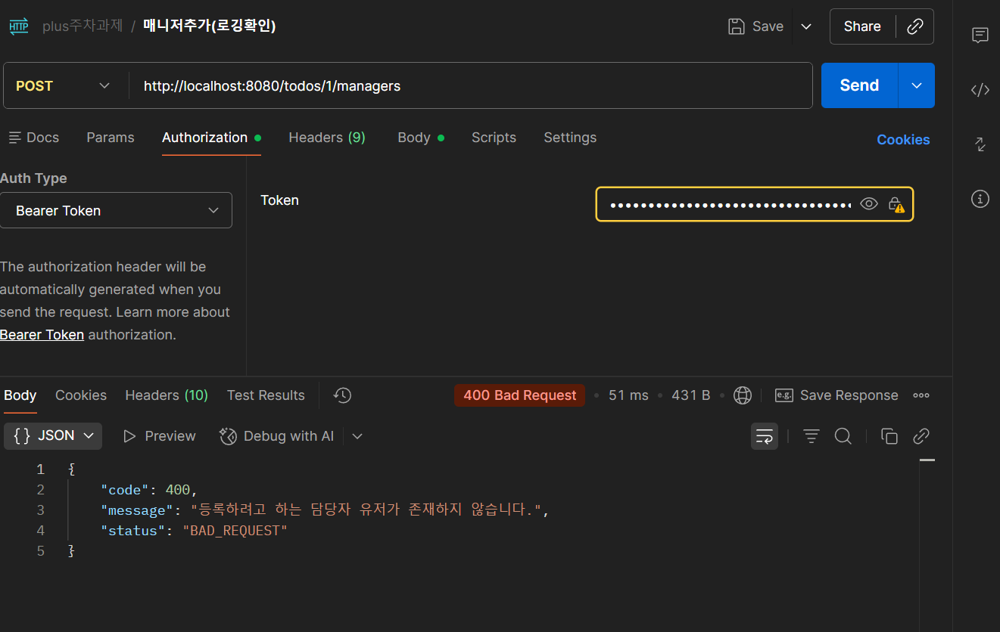 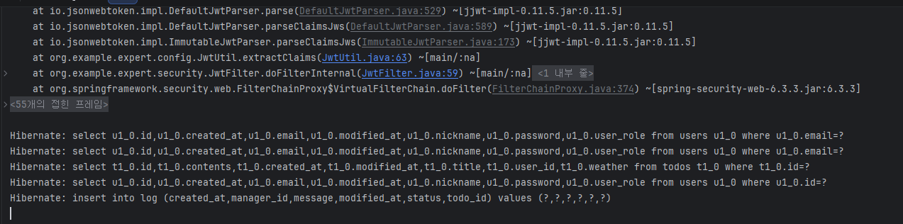 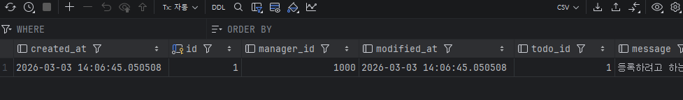

4. 대용량 데이터 검색시간 단축시키기
- 데이터 생성 완료
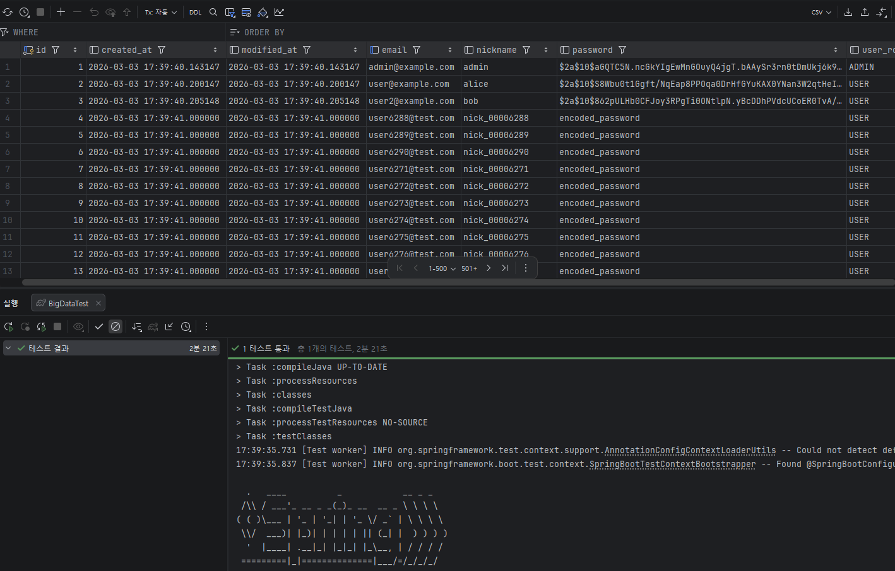
- 기본 상태: 4.42초
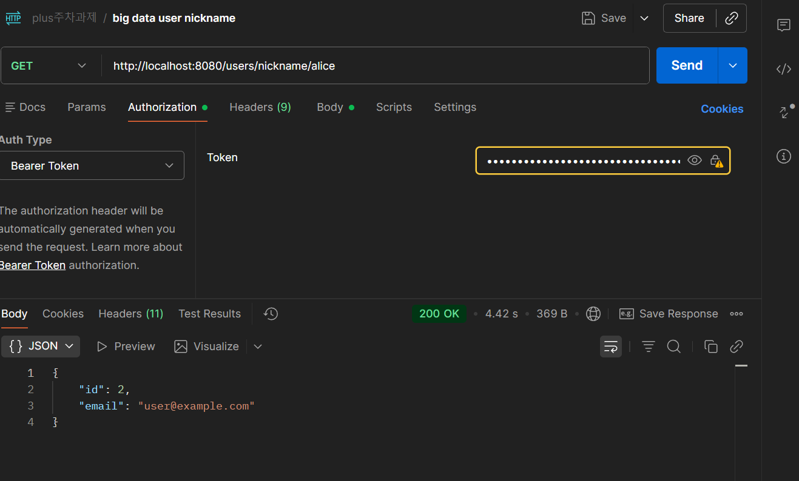
- 인덱스 생성 후: 0.236초
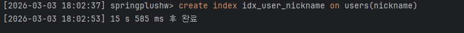 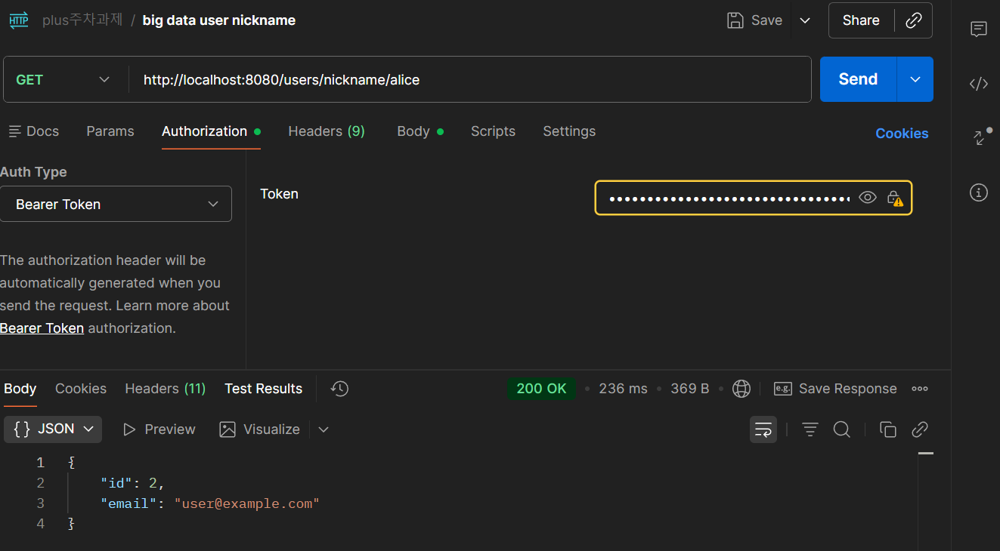
- dto projection으로 id email만 가져오게 함: 0.272초
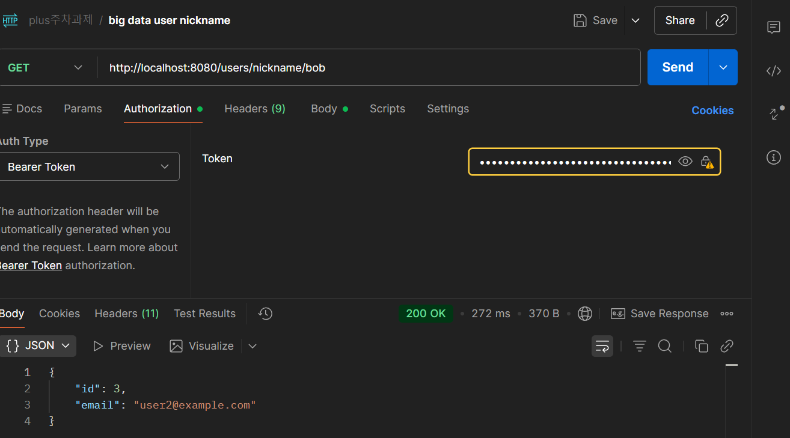
- 커버링 인덱스 만들기: 0.247초
```
CREATE INDEX idx_nickname_cover
  ON users (nickname, id, email);
```
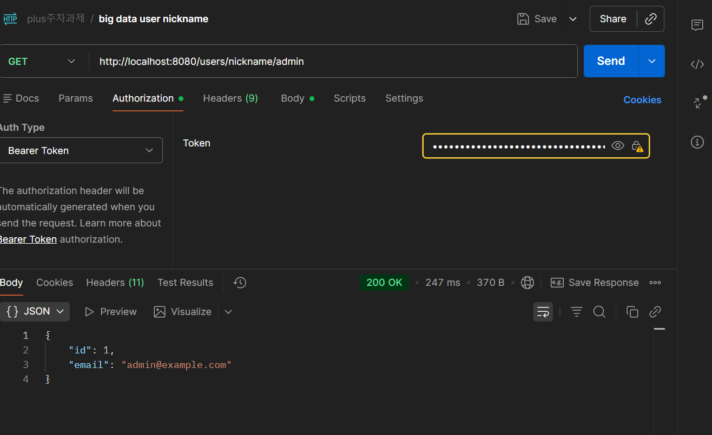
> explain으로 확인결과 복합 인덱스를 사용하지 않음. 찾는 대상이 1개이므로 복합 인덱스는 효과가 없는 것으로 생각됨

- 레디스 적용하기
 첫 조회시: 0.351초
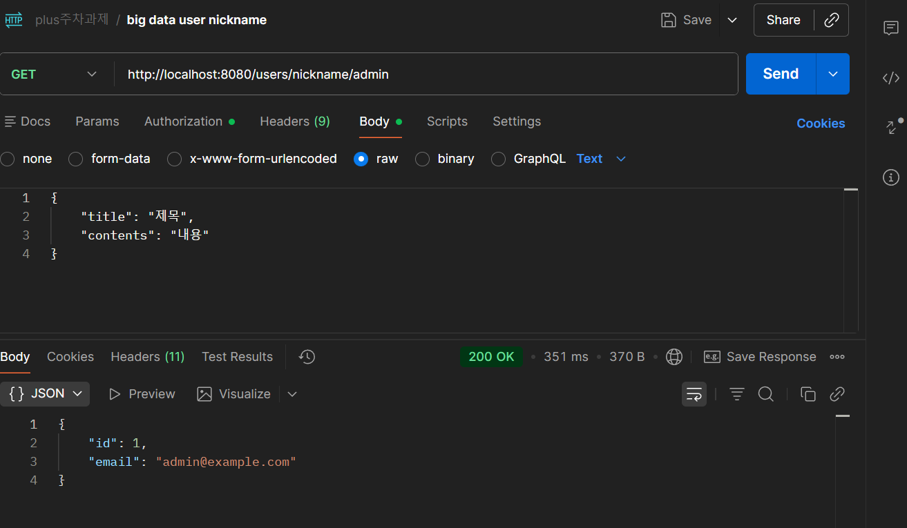
 두번째 조회시: 0.11초
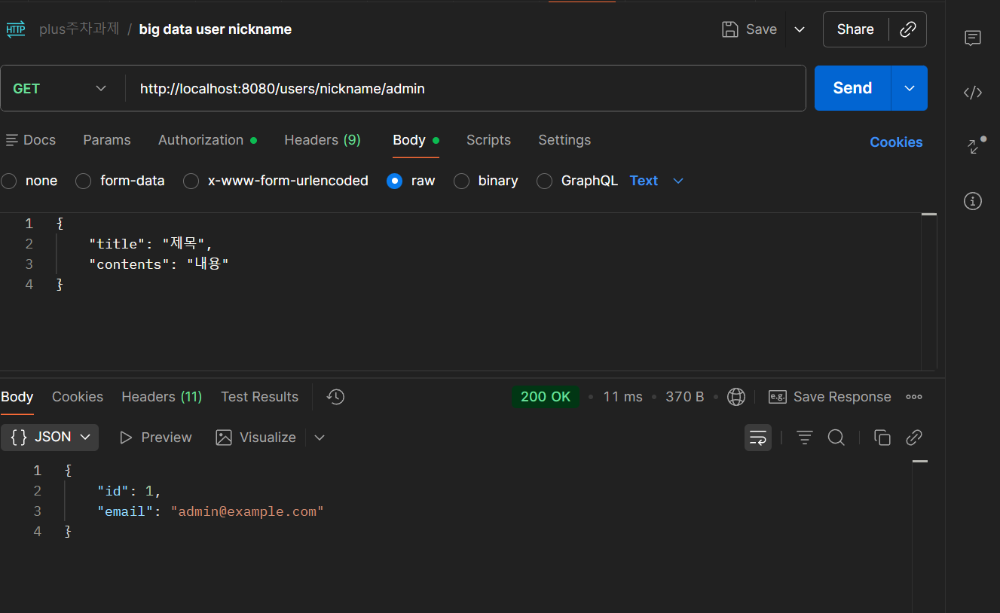